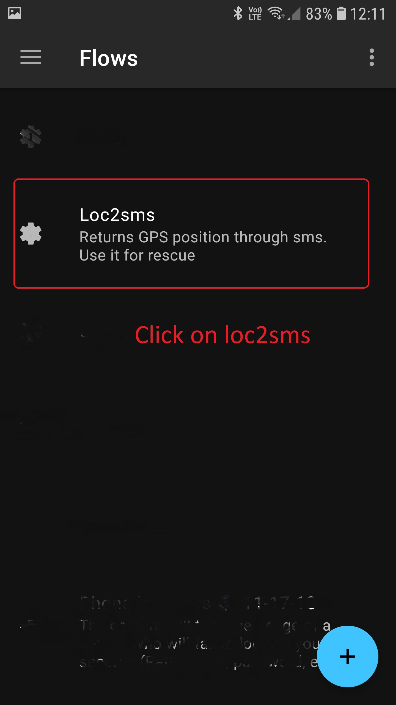
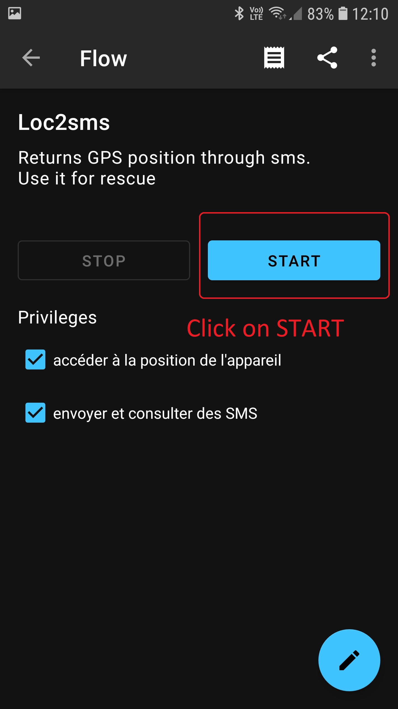
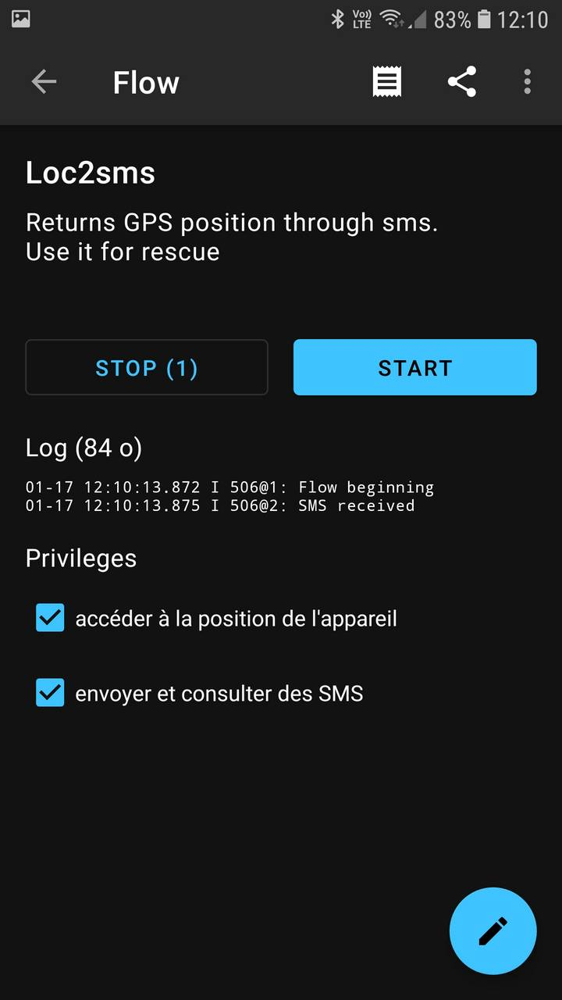
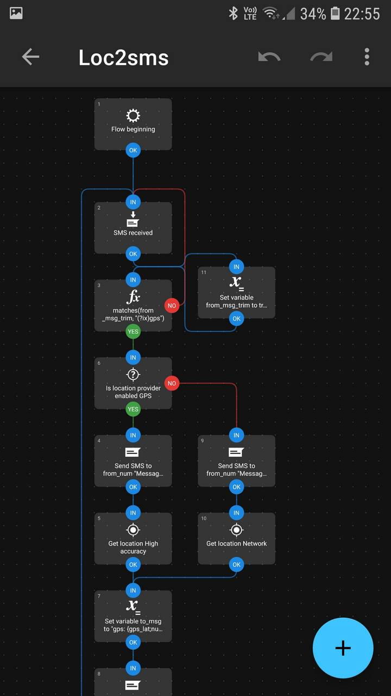

= loc2sms: be localized with an SMS.
:author: Julien Morat
:email: julien.morat@gmail.com
//:sectnums:
:toc:
:toclevels: 1
:experimental:

== rational

I made it for safety while flying. Specifically, to let my mates know where I am, in case they are wondering if I am safe.

The key features are :

 . *robustness*: always working, I cant forget it, as long as my mobile is on,
 . *reliability*: works even without GSM-data coverage (edge, 3G, 4G),
 . *privacy*: I know who and when is asking for my position.

== install

Relies on image:https://llamalab.com/img/automate/ic_launcher-256.png["icon", width=24px] *_automate_*
for image:https://upload.wikimedia.org/wikipedia/commons/d/d7/Android_robot.svg["android",  width=24px] *_android_*.

This app allows any non-developer user to build automation through design of block diagrams and flows.
So, before installing *_loc2sms_*, you need to install *_automate_* (see section below).

 - install image:https://llamalab.com/img/automate/ic_launcher-256.png["icon", width=24px] *_automate_* app from android store:
image:https://play.google.com/intl/en_us/badges/images/apps/en-play-badge.png[link::https://play.google.com/store/apps/details?id=com.llamalab.automate&referrer=utm_source%3Dhomepage, width=100px],

 - download *_loc2sms.flow_* link:https://github.com/jujumo/loc2sms/blob/master/bin/Loc2sms.flo[github.com],

 - open *_loc2sms.flow_* (it should automatically propose to use _automate_),

 - make sure all privileges are checked, and click on "_start_" button:

 - it should be marked as started,

  - then exit, and check it is working (see __usage__).

NOTE: See more about image:https://llamalab.com/img/automate/ic_launcher-256.png["icon", width=24px] *_automate_* on link:https://llamalab.com/automate/[llamalab.com].

== usage

make sure (see __install__ for details):

 - image:https://llamalab.com/img/automate/ic_launcher-256.png["icon", width=24px] *_automate_* is installed (see install section),
 - *_loc2sms.flow_* marked as started,
 - your GPS is on.

Then you can:

 - send an SMS to your phone (you can do it from the phone itself for testing),
 containing the word __"GPS"__.

== contribute

*_loc2sms_* is a simple script using the graph tool of image:https://llamalab.com/img/automate/ic_launcher-256.png["icon", width=24px] *_automate_*.

You can simply open it, examine it, and modify it.
Please, provide feedback if you have any comment.
